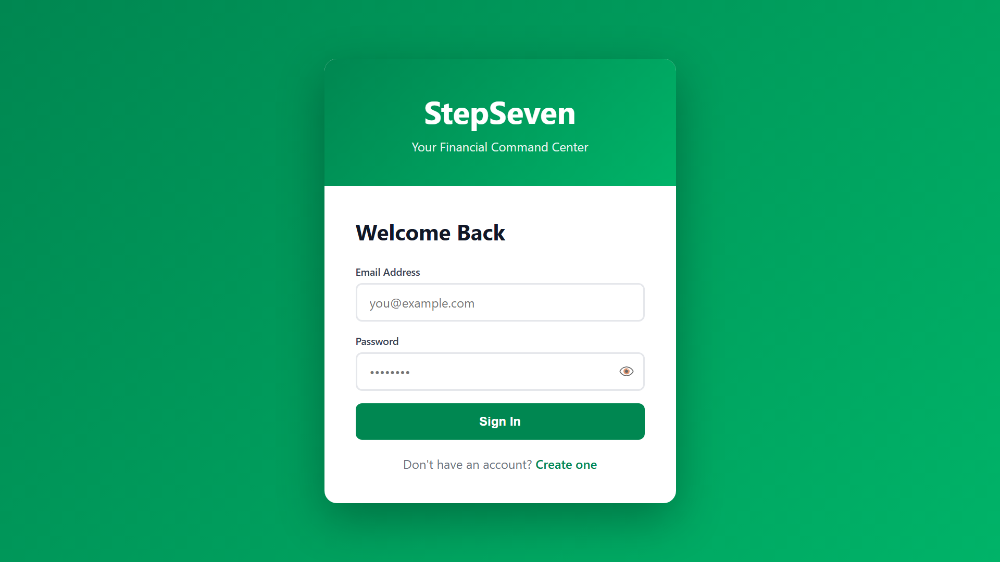
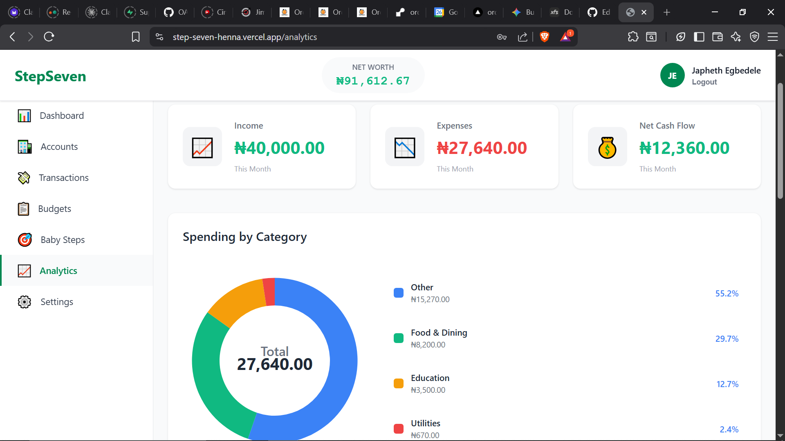
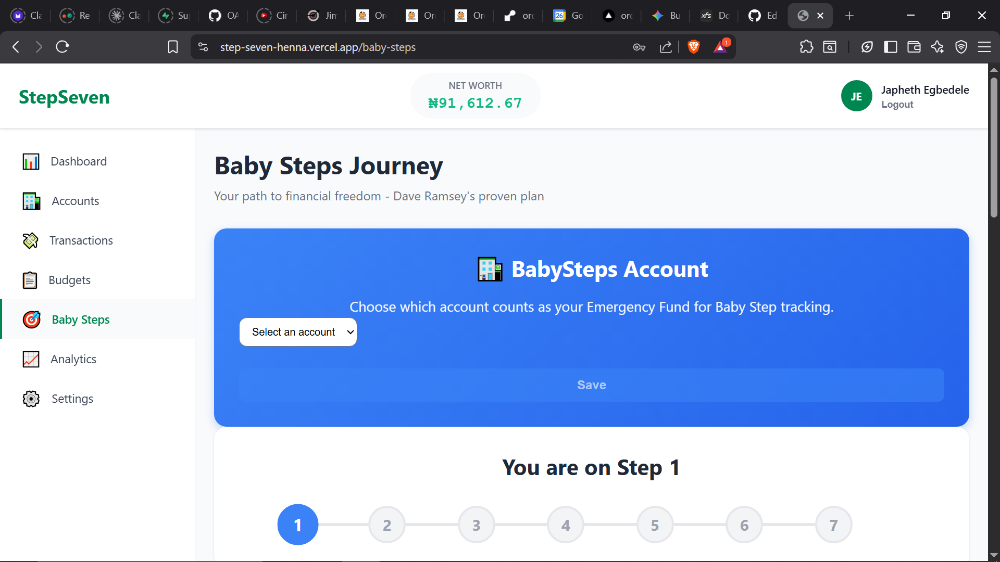
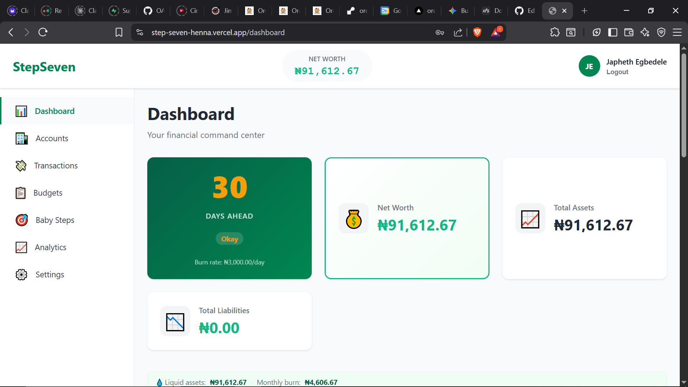

# StepSeven: Financial Command Center

StepSeven is a Nigerian-focused budgeting and cashflow tracker that helps you manage accounts, log transactions, and follow Dave Ramsey-style Baby Steps in one place. It matters because most finance tools don’t fit Nigerian realities (naira-first workflows, local banking patterns, and day-to-day cash movement), which makes consistent tracking harder than it should be.

## The Problem
Most budgeting apps assume US-centric banking rails and budgeting habits, so Nigerian users end up fighting the tool (currency handling, account structure, and cash-heavy workflows) instead of getting clarity. That friction leads to incomplete data, inaccurate insights, and missed progress signals.

## The Solution
StepSeven provides a naira-first “command center” for accounts and transactions, with Baby Steps progress and analytics built on top of your real balances. It’s designed to make daily money tracking fast, accurate, and actionable—so you can see where your money is going and how far ahead you are.

**Tech Stack:** Node.js, Express, MongoDB (Mongoose), React (Vite), React Router, Context API, Axios

## Key Features
- Accounts (Cash/Bank/etc) with starting balances and an Emergency Fund flag for Baby Steps tracking
- Income/Expense transactions plus transfers between accounts
- Baby Steps progress + “Days Ahead” metric (liquid assets vs burn rate)
- Analytics and category breakdowns for monthly spending insights
- Cookie-based auth (JWT in HTTP-only cookies) for a smoother web experience

## Live Demo / Screenshots
<p>
  
</p>
<p>
  
</p>
<p>
  
</p>
<p>
  
</p>

## Setup / Installation

### Prereqs
- Node.js 18+
- MongoDB 6+

### 1) Backend
From repo root:

```bash
cd backend
npm install
```

Create `backend/.env`:

```env
NODE_ENV=development
PORT=5000
MONGO_URI=mongodb://127.0.0.1:27017/stepseven
JWT_SECRET=replace_me_with_32+_chars
JWT_EXPIRE=7d
CLIENT_URL=http://localhost:5173
```

Run:

```bash
npm run dev
```

Health check: `GET http://localhost:5000/api/health`

### 2) Frontend
From repo root:

```bash
cd frontend
npm install
```

Create `frontend/.env.development`:

```env
VITE_API_URL=http://localhost:5000
```

Run:

```bash
npm run dev
```

Open `http://localhost:5173`.

## Deployment (Vercel frontend + Render backend)

### Backend env (Render)
- `NODE_ENV=production`
- `MONGO_URI=...`
- `JWT_SECRET=...`
- `CLIENT_URL=https://<your-vercel-app>.vercel.app`

### Frontend env (Vercel)
- `VITE_API_URL=https://<your-render-service>.onrender.com`

Notes:
- The frontend normalizes `VITE_API_URL` to target `.../api` (so both `https://host` and `https://host/api` work).
- Auth uses an HTTP-only cookie; in production the API sets cookie attributes compatible with cross-site requests (`SameSite=None; Secure`).

## Status
In active development.

## Troubleshooting
- **404 calling `/auth/me`**: your frontend is hitting the API without `/api` in the base URL. Ensure `VITE_API_URL` is set correctly.
- **401 loops back to login after signing in**: cookie likely not being sent (wrong `CLIENT_URL`, CORS not allowing your origin, or missing HTTPS in production).
